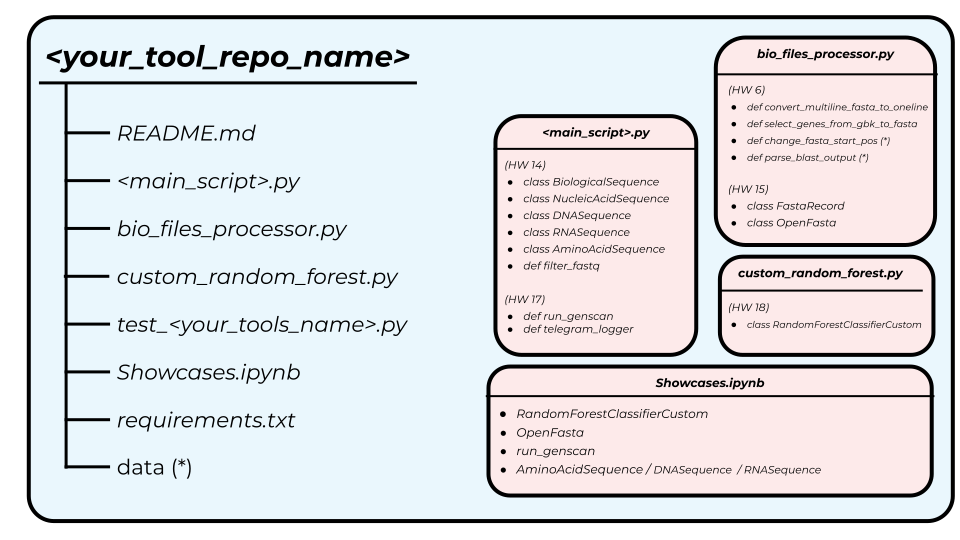

# HW 18. Parallel Wrap Up

Вот оно, последнее домашнее задание на курсе *Программирование на Python* годовой программы ИБ 2023/24. Пришло время оглянуться назад и подвести некоторый итог. 

## 1. Заворачиваем с собой

Весь год, помимо обычных домашек, мы работали с вашими собственными тулами. Пришло время окончательно привести их в порядок, а также добавить что нибудь еще, чтобы в итоге вы могли этим хвастаться при подаче на учебу / работу да и просто перед родителями. 


Последний раз мы обновляли ваш репозиторий в ДЗ 14. У вас есть 2 равноправных варианта:
- Влить ветку HW_14 в main и начать новую ветку HW_18
- Начать новую ветку HW_18 из HW_14

***!!! Вам нужно самим сделать PR из новой ветки HW_18 в main или HW_14 !!!***

Глобально задачи такие:

1) Добавить ваши результаты из новых домашек (см. рисунок ниже). Я описал ожидаемое содержание файлов. То что на картинке со (*) можно не добавлять. Если у вас чего-то еще нет или вы не хотите его добавлять в этот публичный репозиторий - окей (лучше в таком случае предупредите меня). Если хотите добавить что-то сверх этого - то окей)
2) Причесать репозиторий, удалить ненужные файлы, причесать код
3) Сделать задание с тестами и случайным лесом (см. ниже)
4) Добавить примеры (см. ниже)

Содержание репозитория должно быть **строго** такое:





### Тесты

Вам нужно самим придумать и **написать 8 тестов** для вашего модуля. Можете тестировать что угодно, что сочтете адекватным.  

**Условия**
 - Как минимум 1 тест должен быть на проверку ошибки
 - Как минимум 1 тест должен быть на чтение/запись файла

Можете использовать любую библиотеку для написания тестов, но в любом случае не забывайте о структуре. Например, тесты здорово группировать по смыслу в классы.

### Showcases

Сделайте ноутбук `Showcases.ipynb` в котором будет прогнано 4 примера работы вашего модуля (см. рисунок выше). Про пример случайного леса см. далее. Можете добавить еще какие-то примеры при желании. 

### README

Плохая новость: кажется README в этом репозитории становится все более оторван от реальности. Хорошая новость: нам нужен README, а не инструкция по использованию. Документировать код в README не надо, ведь у вас уже есть докстринги, аннотации типов и ноутбук с парой примеров. 

> **Удалите все неактуальное полотно текста из README. Напишите кратенькое описание что это вообще за репозиторий и что там есть.** 

Задача этого README чтобы какой-то сторонний человек открыв ваш репозиторий понял что это вообще такое. Так и пишите: это домашки, у меня тут функции, ООП и API. Типа того.  


### Чекпоинты

 Что нужно не забыть сделать:
+ Добавить `run_genscan` и `telegram_logger` в главный скрипт
+ Добавить `OpenFasta` и `FastaRecord` в `bio_files_processor.py`
+ Сделать 6 тестов
+ Имеющиеся функции по возможности причесать, учесть комментарии из прошлых PR, добавить докстринги и аннотации типов где не хватает
+ Сделать `cutom_random_forest` (см. следующее задание)
+ Добавить необходимые примеры в `Showcases.ipynb`
+ Добавить необходимые данные в папку `data` (если необходимо)
+ Сделать актуальный ***requirements.txt***!!! (или *environment.yaml*)

## 2. Параллельное программирование

Параллельно вам надо сделать задание по параллельному программироваению. Всего одно, зато какое!

### Параллелим случайный лес

В одном из заданий по ML от вас требовалось написать кастомную реализацию Random Forest. Её проблема состоит в том, что она работает медленно, так как использует всего один поток для работы. В данном задании от вас требуется добавить возможность обучать случайный лес параллельно и использовать параллелизм для предсказаний. Для этого вам понадобится:

1. Взять ваш `RandomForestClassifierCustom` из ДЗ 5. Ensembles с курса ML.
2. Добавить аргумент `n_jobs` в метод `fit`
3. Добавить аргумент `n_jobs` в методы `predict` и `predict_proba`
4. Реализовать функционал по распараллеливанию в данных методах
5. Полажить это все в ваш репозиторий в скрипт `custom_random_forest.py` (см. предыдущее задание)


В результате код `random_forest.fit(X, y, n_jobs=2)` и `random_forest.predict(X, y, n_jobs=2)` должен работать в ~1.5-2 раза быстрее, чем `random_forest.fit(X, y, n_jobs=1)` и `random_forest.predict(X, y, n_jobs=1)` соответственно

Если у вас по каким-то причинам нет кода случайного леса из ДЗ по ML, то вы можете написать его заново или попросить у однокурсника. Детали реализации ML части оцениваться не будут, НО, если вы поломаете логику работы алгоритма во время реализации параллелизма, то за это будут сниматься баллы

В задании можно использовать только модули из стандартной библиотеки питона, а также функции и классы из sklearn при помощи которых вы изначально писали лес.

### Хвастаемся

В ноутбуке `Showcases.ipynb` сделайте датасет для классификации:

```python
from sklearn.datasets import make_classification


X, y = make_classification(n_samples=100000)
random_forest = RandomForestClassifierCustom(max_depth=30, n_estimators=10, 
                                             max_features=2, random_state=42)
```

Обучите ваш `random_forest` в 1 поток и в 2, замерьте время. Напечатайте 3 метрики, которые доказывают что вы верно распаралеллили код:
1. Время выполнения `fit` с 1 потоком и с 2 потоками (2 числа) 
2. Время выполнения `predict` с 1 потоком и с 2 потоками (2 числа)
3. Полученные предсказания совпадают (1 bool)

## **Баллы**

#### **Суммарно: 50 баллов**

Из них:
- 10 за написанные тесты
- 15 за параллельный случайный лес
- 10 за оформление репозитория, причесывание кода и актуализирование README

***❗️❗️❗️ Приложите ссылку на PR в Google Class, иначе задание не будет проверяться ❗️❗️❗️***

### **Предполагаемый результат**

Благодаря этой домашке вы
- Попрактикуетесь с распараллеливанием задач
- Попрактикуетесь с придумыванием тестов
- Соберете все ваши заслуги за год питона в таком виде, чтобы это не пропало даром и вы могли прикладывать ссылку на этот репозиторий в CV. Может быть, это всего лишь домашки, и впереди у вас будет еще много крутейших репозиториев. Но пока - пусть будет хотя бы это.

Тем более это на самом деле важный опыт. Нынче бывает сделал кучу крутого анализа, сабмитишь в Нейчур (Priroda), а редактор пишет: оформьте пожалуйста репозиторий. И приходится сидеть собирать свои скрипты годичной давности так чтобы это было не стыдно людям показать. 


Удачи! ✨✨


